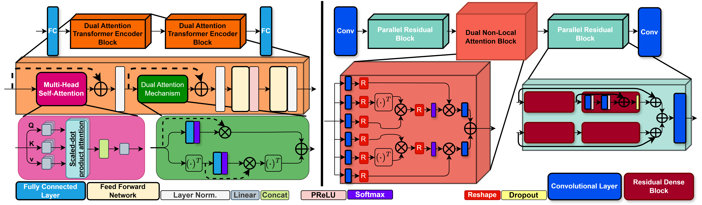
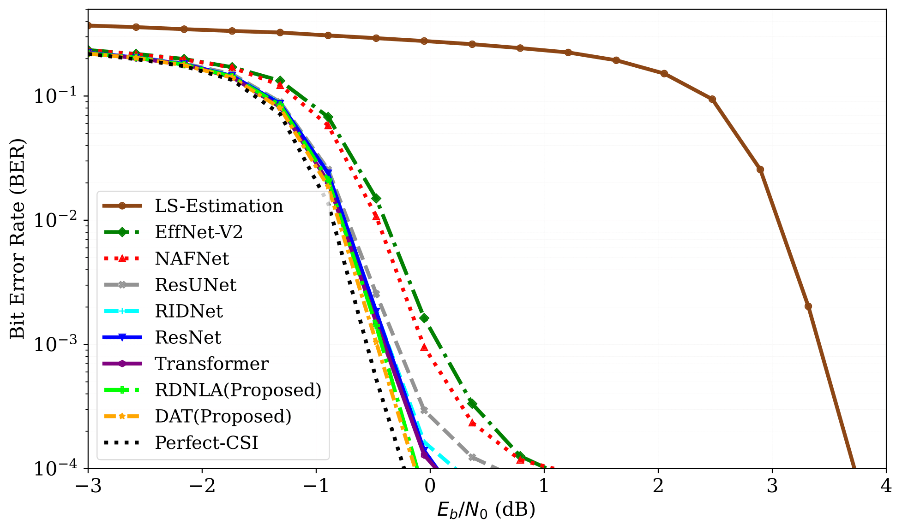
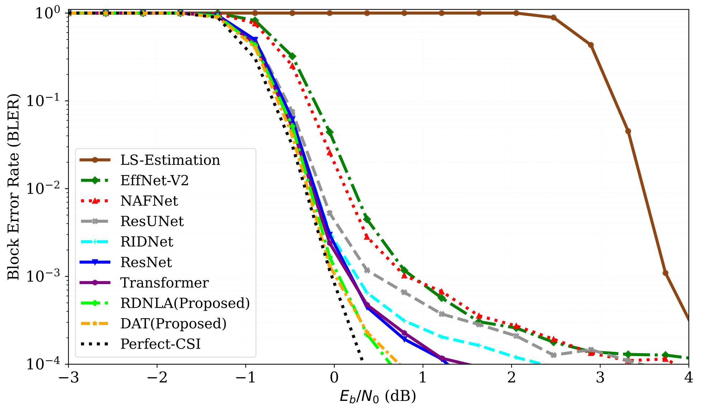

# sionna-nn-receiver-playground

A collection of Jupyter Notebook experiments demonstrating "Novel Deep Neural OFDM Receiver Architectures for LLR Estimation" estimation using NVIDIA Sionna.
The notebooks will be released upon acceptance of the paper.
## 📖 Paper Overview

This repository implements the methods from the paper **"Deep Neural OFDM Receivers for LLR Estimation"**, showcasing:

* **Neural Architectures**: Convolutional, recurrent, residual, and attention‑based models (, Dual Attention Transformer (DAT), and Residual Dual Non‑Local Attention Network (RDNLA)).
* **LLR Estimation**: Direct mapping from received OFDM waveforms to LLRs without explicit demodulation chains.
* **Performance Evaluation**: BER and BLER curves over a range of \$E\_b/N\_0\$ values.
* **GPU Acceleration**: Powered by [NVIDIA Sionna v0.19.1](https://github.com/NVlabs/sionna).

## 📂 Repository Structure

```
├── figures/              # Paper figures (system model, BER/BLER plots)
│   ├── bler_vs_ebn0.pdf
│   ├── ber_vs_ebn0.pdf
├── notebooks/            # Jupyter Notebooks for all experiments
├── plotting/             # scripts for plotting
├── outputs/              # saved weights, figures 
├── requirements.txt      # Python dependencies (includes Sionna v0.19.1)
└── README.md             # This file
```

## 📥 Installation

1. **Clone the repository**

   ```bash
   git clone https://github.com/yourusername/sionna-nn-receiver-playground.git
   cd sionna-nn-receiver-playground
   ```

2. **Set up a Python environment**

   ```bash
   python3 -m venv venv
   source venv/bin/activate     # macOS/Linux
   venv\Scripts\activate      # Windows
   pip install -r requirements.txt
   ```

> **Note:** It requires `sionna==0.19.1`. For full Sionna documentation, visit the [NVIDIA Sionna GitHub](https://github.com/nvidia/sionna). Please run these notebooks in the same virtual environment that created for Sionna


## 🖼️ Figures

### OFDM System Model


### Proposed Neural Network Architectures for LLR Estimation DAT and RDNLA



### BER & BLER Performance



